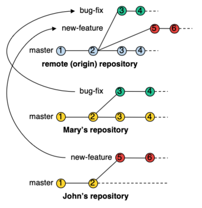
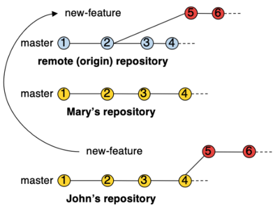

# My Git Notes

A short overview about Git totally inspired on [this tutorial](http://rogerdudler.github.io/git-guide/), [this another one](https://nvie.com/posts/a-successful-git-branching-model/), and the [git course on Alura platform](https://cursos.alura.com.br/course/git).

Sections 1-11 give an overview about the git commands. Sections 12-13 (the most interesting ones =D) show the git workflow and good practices to work in a personal or collaborative projects.

## 1. Setup
Installing git:  
Linux: `sudo apt-get install git`  
Mac: `brew install git`  

Set your name and email:
```
git config --global user.name "Your user name"
git config --global user.email "myusername@myemail.com"
```

## 2. Create a New Git Repository
```
mkdir my-new-repository  
cd my-new-repository  
git init
```

## 3. Checkout a Git Repository
When using a remote server, your command will be:
`git clone username@host:/path/to/repository`
`git clone username@host:/path/to/repository my-repository`

Or link/add a git repository on **your machine** to the **remote server**:
`git remote add origin https://remote-server/username/path/to/repository.git`  

**origin** is convention that indicates that the remote repository is the origin of the repository.


## 4. Git Areas


## 5. Add & Commit
`git status`: check the status of all files from the repository
`git whatchanged`: see all changes in details

We have several ways to **add/update** files from *Working Directory* to Index on git:  
* `git add index.html`: add the file index.html to be commited  
* `git add file1 file2 file3`: adding multiple files to be commited  
* `git add folderPath`: add an entire folder to be commited  
* `git add .` or `git add -A` or `git add --all`: add all changes (new, modified, deleted files)  
* `git add *`: similar to the first, but no adding files with names starting with '.'  
* `git add -u` or `git add --update`: update all changes (modified and deleted files only)  
* `git add -i`: run the iterative mode for adding/updating files

To **commit**:  
`git commit -m "nice message"`  

Now the file is committed to the **HEAD**, but not in your *remote repository yet*.


## 6. Pushing Changes
Your changes are now in the **HEAD** of your *local working copy*. To send those changes to your **remote repository*, execute:  

`git push origin master`

**origin** is the name of the remote repository (which was previously linked with our local working copy).  
**master** is the name of the *branch* that we are pushing. By default, **master** is the name of the *main* branch on git.


## 7. Branching
*Branches* are used to develop new features (or correct bugs) isolated from each other. The **master** branch is the *default* branch when you create a repository.  
Use other branches for development and merge them back to the master branch upon completion. 


### 7.1 Creating Local Branches
* `git branch refactoring`: create the branch *refactoring*  
* `git checkout refactoring`: switch to branch *refactoring*  
* `git checkout -b refactoring`: create the branch *refactoring* and switch to it afterwards  

After committing something in the branch:  
  


### 7.2 Listing Local and Remote Branches
* `git branch`: list all **local** branches and which branch you are working 
* `git branch -r`: list the remote branches  
* `git branch -a`: list all (local and remote) branches  

### 7.3 Pushing a Local Branch to the Remote Repository
After creating the branch *refactoring*, it is not available in the *remote repository* yet. After some commit(s) in this branch, you can **push** it (them) to the *remote repository*:  
`git push origin refactoring`  

Then, the remote repository will have a true copy (with the same name) of the local branch *refactoring*

  

However, every time we **update** both our local repository and remote one, we need to indicate the remote repository and the name of the local/remote branch to push/pull:  

* `git push origin refactoring`: Send the commits from the local branch *refactoring* to the remote repository  
* `git pull origin refactoring`: update/get the remote branch *refactoring* from the remote repository

For example, by removing the `origin refactoring`, we have the following error(s):  
`git push` (on branch *refactoring*)  
```
fatal: The current branch refactoring has no upstream branch.
To push the current branch and set the remote as upstream, use

    git push --set-upstream origin refactoring
```

To avoid that, we can indicate the *branch's track* from our **local** branch to the **remote** one. For that, use one of the commands bellow:  
    * `git push --set-upstream origin refactoring`  
    * `git push -u origin refactoring`  
    
They push the commits and link the local and remote branches *refactoring*. From the next changes/commits, we can just run `git push` (on the local branch *refactoring*).  


<br/>

### 7.4 Deleting branches
To delete a *local* branch (nothing changes in the remote repo):  
1. `git checkout master`: switch to another branch (e.g., master)  
2. `git branch -d refactoring`: delete the required branch

Only the **local** branch (not the **remote** one) is deleted. To get a **remote** branch to the local repository:  
`git branch -t refactoring origin/refactoring`  

where *origin/refactoring* is the remote branch, and *refactoring* is the local one.  

To remove a **remote** branch:  
1. `git push origin -d refactoring` or  
2. `git push origin :refactoring`
<br/><br/>

## 8. Update & Merge
To update your local repository to the newest commit, execute:  
`git pull`  
in your **working directory** to *fetch* and *merge* remote changes.  

To *merge* another branch into your active branch (e.g. master), use  
`git merge <branch>`  
in both cases git tries to auto-merge changes.  

Before merging changes, you can also preview them by using  
`git diff <source_branch> <target_branch>`

#### Minimizing Effort during Merge  
Some tips can help you to avoid some effort during merging.  
1. Commits with a few content/files  
    1.1. This will generate small and less laborious conflicts to solve  
2. Frequent synchronization (pull) with the remote repository  

## 9. Tagging
It's recommended to create **tags** for software releases. You can create a new tag named 1.0.0 by executing  
`git tag 1.0.0 1b2e1d63ff`  

the *1b2e1d63ff* stands for the first **10 characters** of the commit id you want to reference with your tag.  

You can get the commit id by looking at the `log` (next section).

## 10. Log
You can study repository history using  
* `git log`  
* `git log --author=bob`: To see only the commits of a certain author  
* `git log --pretty=oneline`: To see a very compressed log where each commit is one line  
* `git log --graph --oneline --decorate --all`: Or maybe you want to see an ASCII art tree of all the branches  
* `git log --name-status`: See only which files have changed  


## 11. Replace Local Changes
you can replace local changes using the command  
`git checkout -- <filename>`  
this replaces the changes in your **working tree** with the last content in **HEAD**. Changes already added to the **index**, as well as new files, will be kept.  

To drop all your local changes and commits:  
`git fetch origin` or  
`git reset --hard origin/master`  

It fetches the latest history from the *server* and point your *local master branch* at it like this.  


## 12. Git Workflow and Best Practices
The first good practice is **always to work in local branches**, not in the **master**. Master is the main branch that must contain the releases (stable versions) of your project/system. At this time, we will not work with the idea of Releases (see Section 12).

Suppose John and Mary are working in the same project. John creates a local branch, based on the master, to develop a new feature whereas Mary creates a local branch to fix some bugs:  
John: `git checkout -b new-feature`  
Mary: `git checkout -b bug-fix`  
  

Each one creates same remote branches and pushes (her)his local commits to there to guarantee remote backups:  
John: `git push -u origin new-feature`  
Mary: `git push -u origin bug-fix`  
  


When finishing her changes or to make them available to other devs, Mary needs to **merge** branch to the branch *master*. For that, she must first check if the master have new updates:  
```
git checkout master
git pull
```

Since there is no new updates, Mary can simply merge her branch to the master one and (optionally) push her updates to the remote repository:  
```
git merge bug-fix
git push origin master
```
  

Note that the local and remote branch *bug-fix* still live. Mary could continue working in it but the *merge* (and then the push) action should be done when finishing all changes in the working branch, so that it is not necessary anymore. Then, Mary could delete her branch by running:  
```
git branch -d bug-fix
git push origin -d bug-fix
```
  

John repeats the same steps to merge his updates to the branch master, and he notes that it was updated (its last commit is now 4 and not 2, when *new-feature* was created).  
If he simply merges her branch to master, he might have to handle multiple conflicts of many commits at once and logs could be confusing.  

To solve that, John first has to update his branch to have the same updates/commits of *master*, i.e., his local branch must have the same **base** of *master* (commit 4 not commit 2). Then, he uses the command:  
```
git rebase master new-feature # or
git checkout new-feature
git rebase master
```
  

Now, he can merge his branch to the master and (maybe) push master (and maybe delete his local and remote branches):  
```
git checkout master
git merge new-feature
git push origin master # or
git push # if local and remote master are linked
```
  

#### Observations
During `git rebase`, git checks conflicts with your branch commit by commit. It first updates all new comments from master and then start applying your commits (one by one). When found a given conflict on a commit, git automatically creates a temporary branch (called *no branch*) so you can resolve the conflict by choosing:  
1. Abort, restore the original branch (before rebasing), and stop rebasing: `git rebase --abort`  
2. Discard your conflicted commit: `git rebase --skip`  
3. Resolver your conflict, add the changes `git add file_fixed.txt`, and then continue rebasing: `git rebase --continue`  

For option 3, git resolve conflicts by adding the new changes to your conflicted commit (it does not generate a new commit).

Finishing rebasing, you can merge your branch to master and push it.  

#### Rule of Thumbs  
1. Prefer keeping your local (remote) branch always updated with the main branch (for example, master) than doing that only during merging. This will avoid having to solve many conflicts at once.  
2. Prefer small commits. Your changes will be easy to visualize and you will have a more detailed history. Consequently, conflicts will be easier to resolve.  


## 13. A Good Branching Strategy  
When working in collaborative project, it will likely have *stable versions* (releases). For this, the branch **master** has the last stable(s) version(s) of the project.  
In order to avoid changing the master for each merging/new updates, a good strategy is to have a second main branch called **develop**. All devs will create new features, etc, by branching **develop** and them merging their branches to it. Once you have a new release of the project, **develop** will be merged to **master**.  
In this sense, the figure below show a more complete branching strategy:  


*Original blog post: http://nvie.com/posts/a-succesful-git-branching-model*


